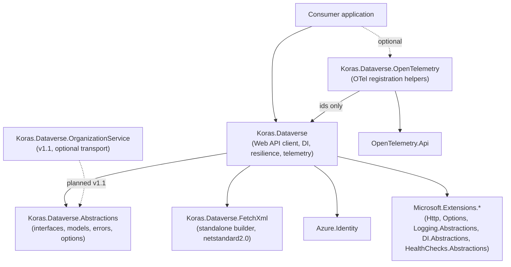
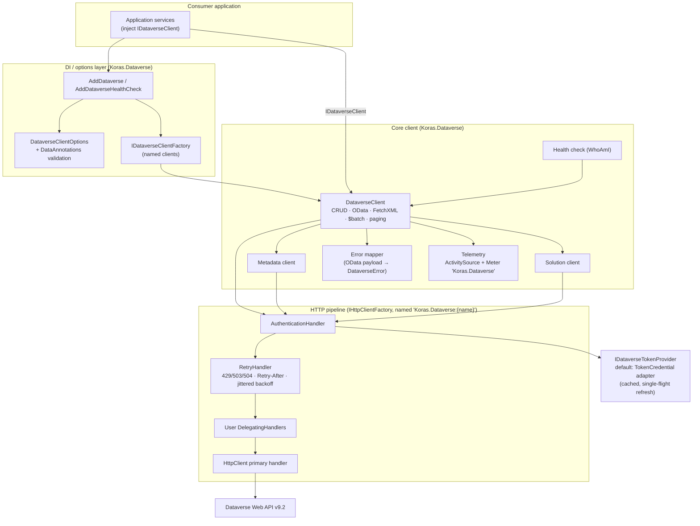
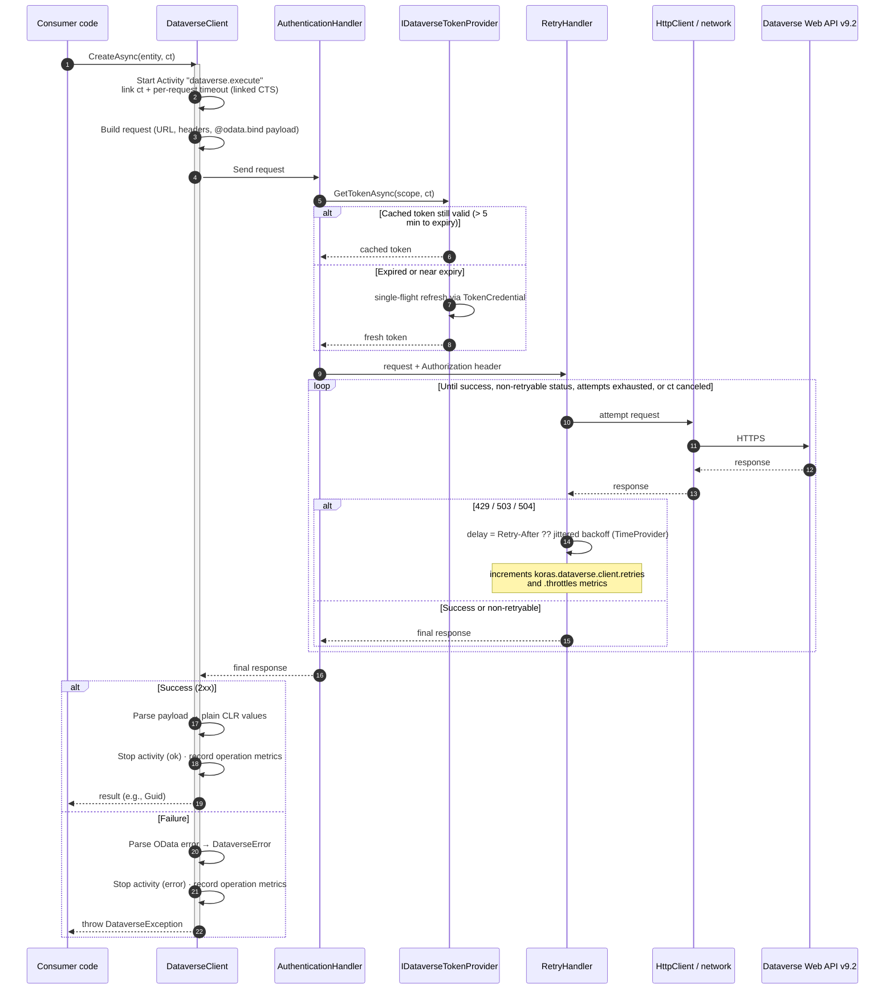
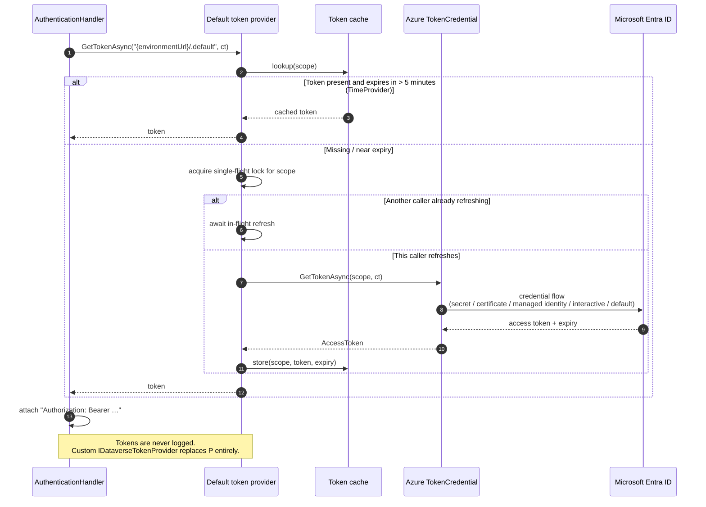
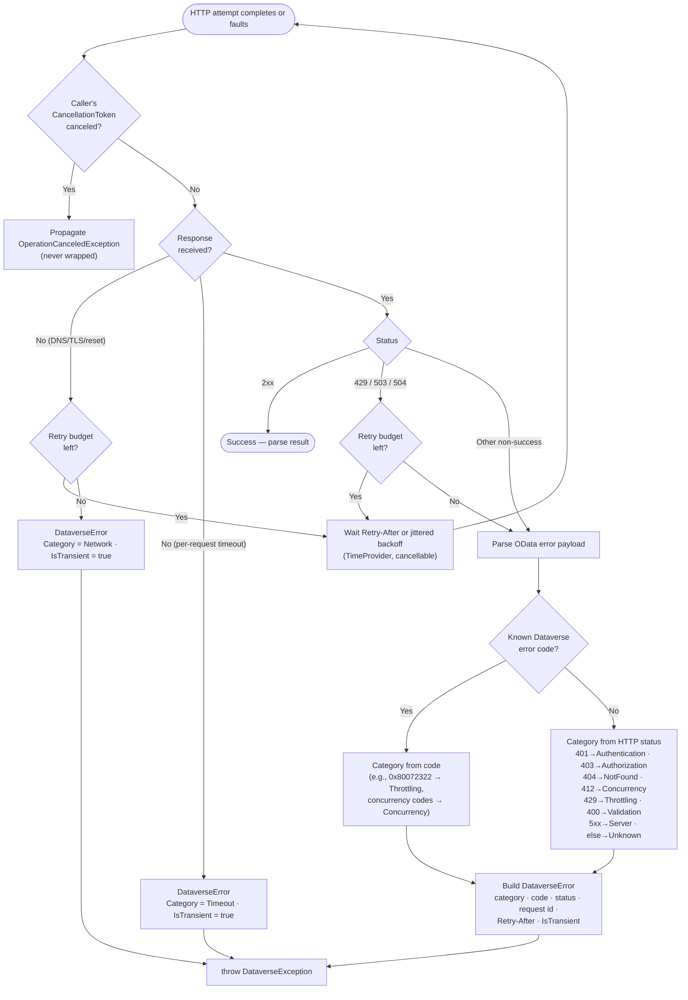
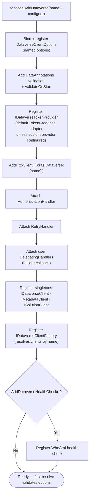
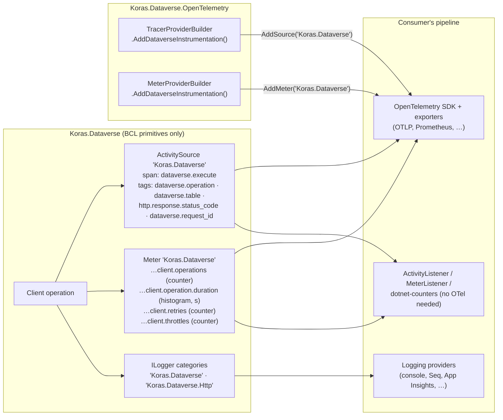

# Architecture Diagrams

> Visual companion to [`overview.md`](overview.md) and §2/§5 of
> [`docs/planning/master-plan.md`](../planning/master-plan.md). If a diagram and the master
> plan disagree, the master plan wins. All diagrams are Mermaid and render on GitHub.

## 1. Package dependency graph

`Abstractions` and `FetchXml` have zero dependencies. Nothing depends on the implementation
package except the OpenTelemetry helper (name constants only).

## 2. Component architecture

## 3. Request lifecycle (with retry loop and token acquisition)

## 4. Provider / auth lifecycle

## 5. Error lifecycle

## 6. DI registration flow

## 7. Telemetry flow

